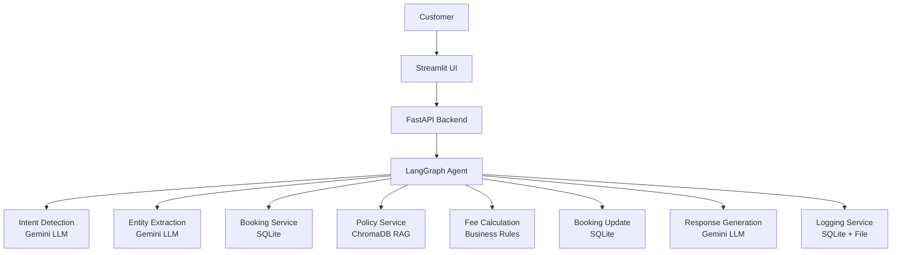
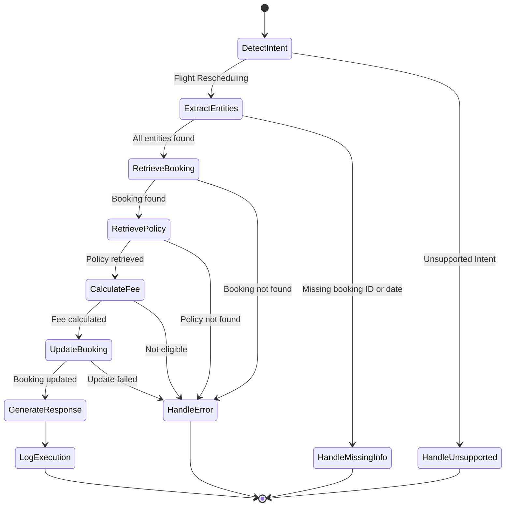
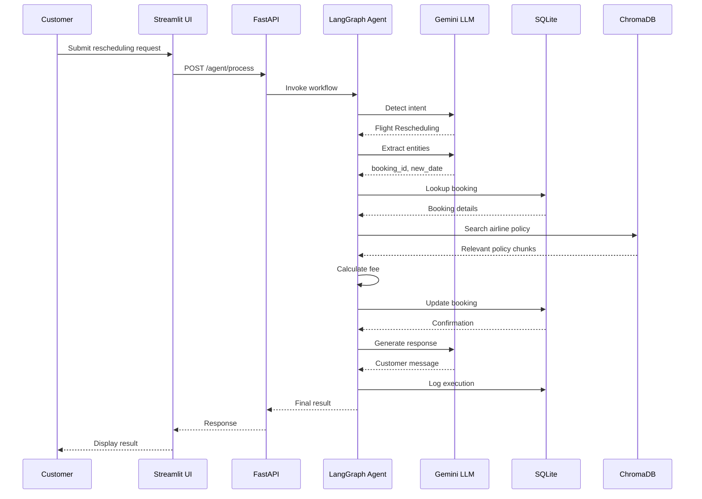

# Architecture Documentation

## 1. Architecture Overview

The AI Flight Rescheduling Agent follows a **modular, tool-based architecture**. The Large Language Model (LLM) acts as the reasoning engine, while specialized services perform business operations.

This separation allows the AI agent to make decisions while ensuring that business logic remains **deterministic and maintainable**.

---

## 2. High-Level Architecture Diagram

---

## 3. Agent Workflow — LangGraph State Machine

---

## 4. Data Flow Sequence

---

## 5. Component Details

### 5.1 LangGraph Agent (`src/agent/graph.py`)
- **Role**: Decision-making orchestrator
- **Type**: StateGraph with conditional edges
- **Nodes**: 8 workflow nodes + 3 error handlers
- **State**: `AgentState` TypedDict flows through all nodes

### 5.2 Business Services (`src/services/`)
Each service follows the Single Responsibility Principle:

| Service | Responsibility | Data Source |
|---------|---------------|-------------|
| BookingService | Retrieve booking details | SQLite |
| PolicyService | Retrieve airline policies | ChromaDB |
| FeeService | Calculate rescheduling fees | Business rules |
| BookingUpdateService | Update booking records | SQLite |
| ResponseService | Generate customer responses | Gemini LLM |
| LoggingService | Record audit trail | SQLite + File |

### 5.3 RAG Pipeline (`src/rag/`)
- **Ingestion**: Markdown policy files → chunks → ChromaDB embeddings
- **Retrieval**: Semantic search with airline metadata filtering
- **Fallback**: Broad search if airline-specific results are empty

### 5.4 Database (`src/database/sqlite.py`)
- **Bookings table**: 10 sample records with realistic Indian airline data
- **Execution logs table**: Full audit trail of every agent execution

---

## 6. Design Principles

1. **Modularity** — Each component has a single responsibility
2. **Separation of Concerns** — AI reasoning, business logic, and data storage are independent
3. **Extensibility** — New tools can be added without redesigning the system
4. **Maintainability** — Components can be updated independently
5. **Observability** — Every significant action is logged
6. **Graceful Degradation** — Keyword fallbacks when LLM is unavailable
